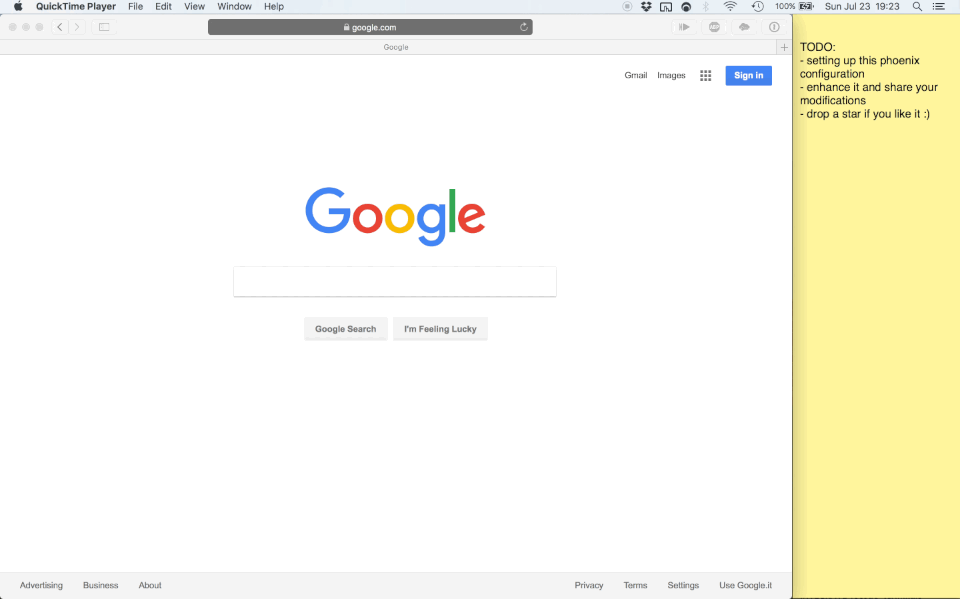

## Spaces Workflow ([DOWNLOAD](https://github.com/fabiospampinato/alfred-spaces-workflow/raw/master/spaces.alfredworkflow))

  

This is part of a Phoenix setup that you can find [here](https://github.com/fabiospampinato/phoenix).

This workflow enables Alfred to work with it.

## License

MIT © Fabio Spampinato
